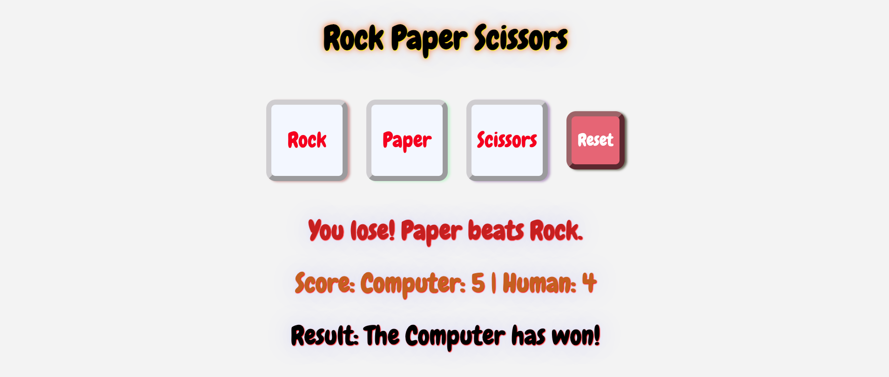
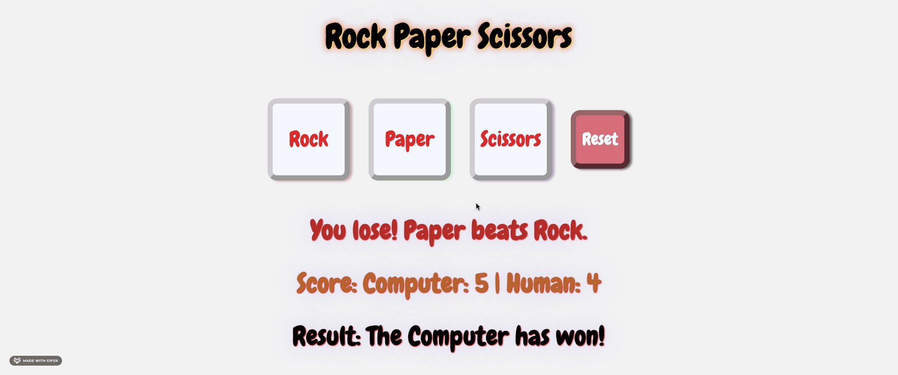

  <h1>Rock Paper Scissors</h1>

  A Game of Rock Paper Scissors ([live preview](https://oghrmatir.github.io/rock-paper-scissors/))

  

## About
`rock-paper-scissors`[^1] showcases a browser-based implementation of the grade school class "Rock Paper Scissors" with a graphical user interface.

[^1]: This [project](https://www.theodinproject.com/lessons/foundations-rock-paper-scissors) is from the [Foundations Course](https://www.theodinproject.com/paths/foundations/courses/foundations) of [The Odin Project](https://www.theodinproject.com/about).

## Showcase

  
  
This is a screenshot of the index page.

  
  
This is a screen cast of the website.

## Technologies
- ***CLI***, ***Git***, ***HTML***, ***CSS***, ***GitHub***, ***GitHub Pages***, ***JavaScript***

## Acknowledgements
- Credit to [ritaly's README-cheatsheet](https://github.com/ritaly/README-cheatsheet) and [ArjunSaili1's comment](https://github.com/TheOdinProject/curriculum/discussions/25472#discussioncomment-5889343) for README.
- Credit to [freesound_community](https://pixabay.com/users/freesound_community-46691455/) on [Pixabay](https://pixabay.com/) for the audio files.

## Contact and Support
- Please do not hesitate to contact **oghrmatir_40617** on discord for project queries.
- This project will no longer be worked upon and no further support will be provided.[^2]

[^2]: The [TOP Strategy guide](https://dev.to/theodinproject/becoming-a-top-success-story-mindset-3dp2) makes it clear to [focus on the point of the assignment](https://dev.to/theodinproject/learning-code-f56#:~:text=Focus%20on%20the%20point%20of%20the%20assignment) and that [foundations isn't a strong portfolio generator](https://dev.to/theodinproject/learning-code-f56#:~:text=Foundations%20isn%E2%80%99t%20a%20strong%20portfolio%20generator) so no point in wasting too much time here.